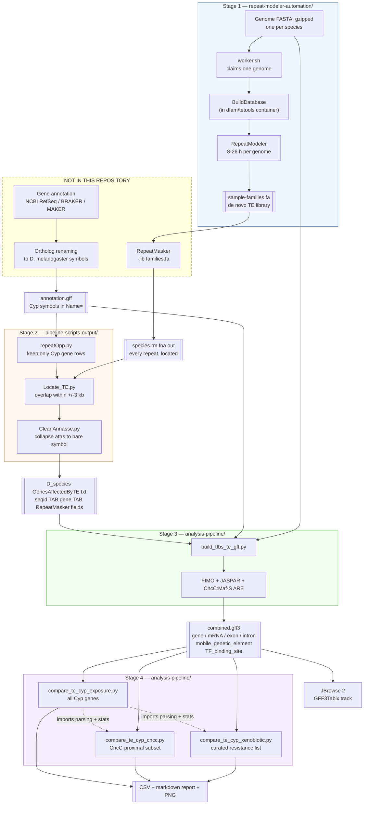
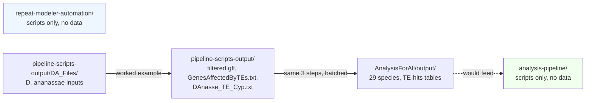

# End to end

## The whole pipeline

## The seam

The dashed box is the important part of this diagram. **Two required steps have no code in
this repository**: RepeatMasker, and gene annotation with ortholog renaming.

Stage 1 produces a TE *library* — a catalogue of repeat families found in a genome. It does
not say where in the genome they are. Turning a library into per-locus coordinates is
RepeatMasker's job, and RepeatMasker is invoked here only by `runMasker.sh`, a file known
from the archive photographs (see `OCR docs/02`) but never committed.

Likewise, Stage 2 needs an annotation GFF whose `Name=` attributes are already *D.
melanogaster* Cyp symbols. Producing that was the job of `ReVamp_Final.py` /
`NEW_Step_5_Replace_gff_Names_with_Dmelanogaster_1_9.py`, also not committed.

So the pipeline as committed is two working halves with a manual bridge between them. If
you have a `*.rm.fna.out` and a renamed `*.gff`, everything downstream runs. If you only
have genomes, Stage 1 will run and then you will stop.

## Where the data in this repository sits on that path

The repository contains **one fully worked example** (*D. ananassae*, every intermediate
preserved) and **29 finished TE-hits tables**, but no combined GFF3 and no comparison
output. Stage 3 and Stage 4 have never been run on the committed data — their inputs are
present, their outputs are not.
