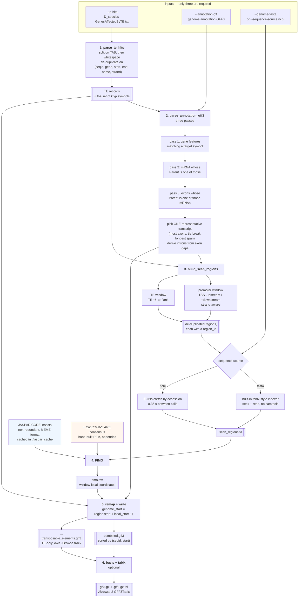
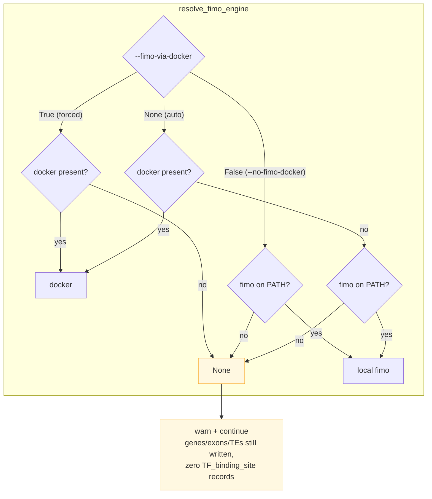
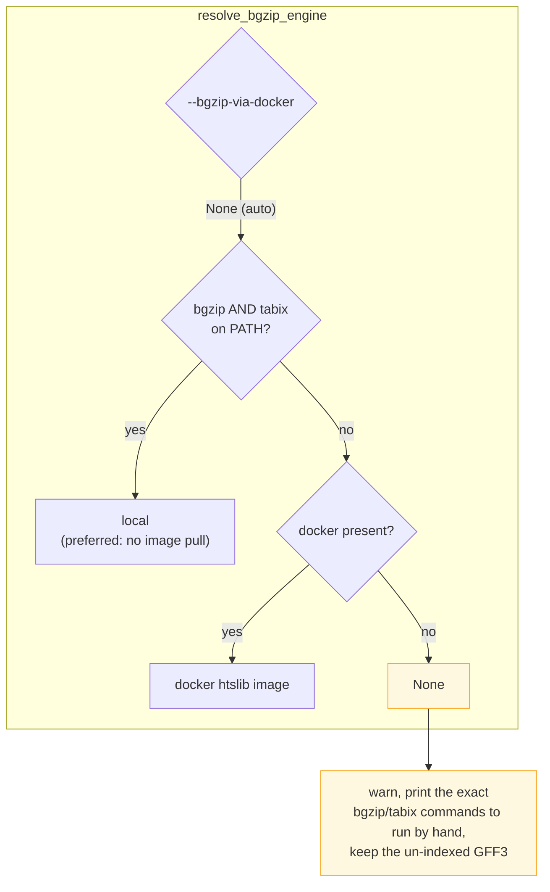
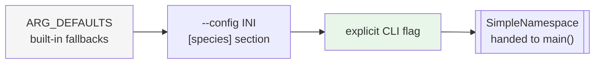

# Inside `build_tfbs_te_gff.py`

## The six stages

## Engine auto-detection

Every optional dependency degrades rather than aborts. Three separate resolvers implement
the same philosophy:

Note the preference is **inverted** between the two: FIMO tries Docker *first* (compiling
MEME Suite natively on Windows is painful, and MEME's own docs recommend Docker there),
while bgzip tries local binaries *first* (htslib is small and usually already installed, so
pulling an image would be the slower path).

> **Consequence worth knowing.** A run with no FIMO engine still succeeds, still writes a
> valid GFF3, and still exits 0 — it just contains **no `TF_binding_site` records at all**.
> That file then flows downstream and makes `compare_te_cyp_cncc.py` report zero
> CncC-proximal genes for that species. That is a data gap, not biology, and the cncc
> script flags it explicitly. See [04-comparison-flow.md](04-comparison-flow.md).

## Option precedence

Most argparse flags default to `None` rather than their real default. That is what lets
`resolve_args()` distinguish *"the user did not pass this flag"* from *"the user passed the
same value as the default"* — without it, a config file could never be overridden by a CLI
flag set to a default-looking value, and a CLI flag could never fail to override a config
file.

Relative paths inside a config section resolve against **the config file's own directory**,
not the current working directory, so a species' config and its data files can be moved
around together.
