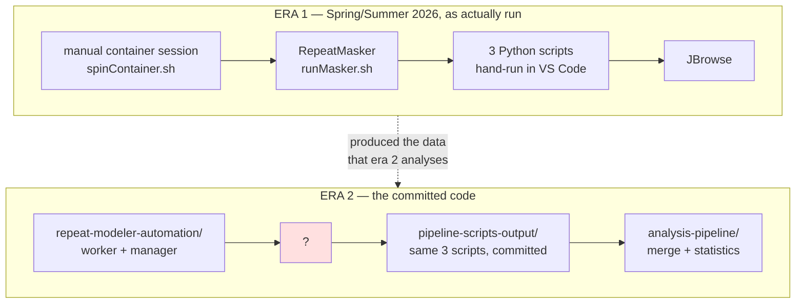
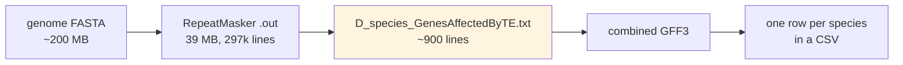
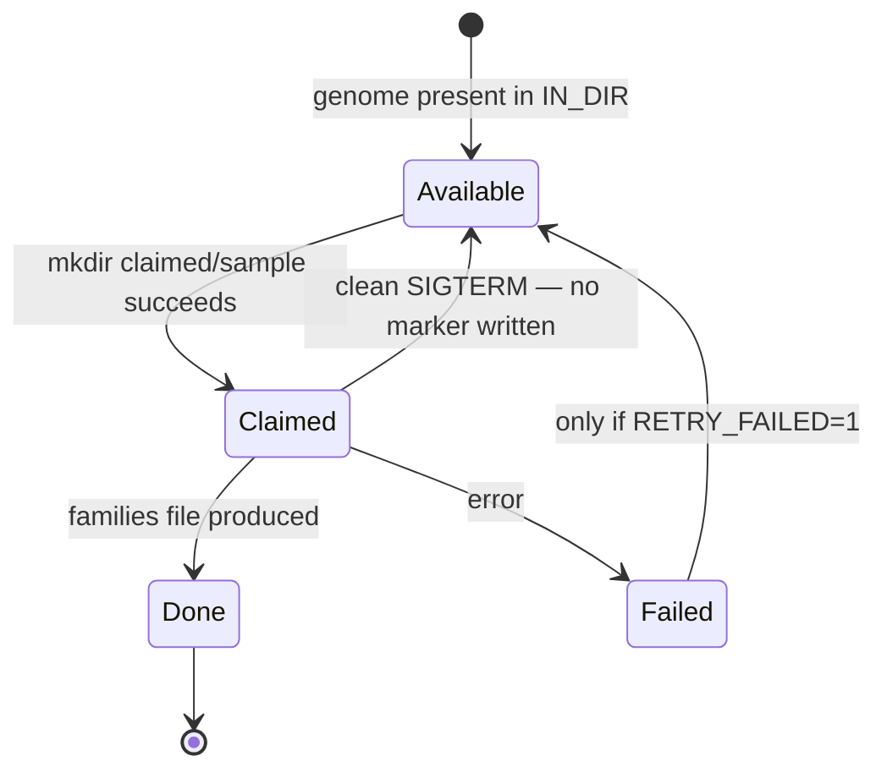

# Pipeline architecture

Why the pipeline is shaped the way it is, and where its seams are. This is the document to
read before changing anything structural.

## The constraint everything else follows from

One number determines the architecture of the first half of this pipeline:

> **RepeatModeler2 runs could last anywhere from 8-26 hours, depending on the size of the
> genome file** — *Atallah Lab Spring 2026 Log (OCR doc 04)*

A directory listing of one real run, timestamped by File Explorer, puts the upper bound
higher still: `genome.2bit` written 7/8 at 4:06 PM, `consensi.fa.classified` written 7/10 at
1:14 PM — about **45 hours**, with `-LTRStruct` enabled *(OCR doc 03c)*. The same listing shows
where the time goes: round-1 to round-2 took 11 minutes, round-4 to round-5 took 13 hours.
RepeatModeler's iterative rounds get dramatically more expensive as they go.

At that cost, and with dozens of genomes, four requirements fall out immediately, and stage 1
is built around them:

1. **It cannot be supervised.** Runs must survive the operator going home.
2. **It must survive interruption.** Losing a day's compute to a reboot is unacceptable.
3. **It must run several genomes at once**, or the queue never drains.
4. **A clean stop must leave work retryable**, not marked failed.

Everything from stage 3 onward runs in seconds to minutes, so none of these apply there, and
the code looks completely different as a result. If the two halves of this project seem
stylistically inconsistent, that is why — they are solving different problems.

## Two eras

The pipeline exists in two versions, and the repository contains pieces of both. Knowing
which era a file belongs to explains most of its oddities.

**Era 1** is the pipeline as the lab actually ran it, recorded only in photographs. It was
interactive, Windows-hosted, and manual at every step: a WSL terminal to start a container
*(OCR doc 01)*, two commands typed by hand inside it *(OCR doc 04)*, then VS Code for the
Python steps with file paths pasted in one at a time *(OCR docs 02, 05)*. It produced all the
real data in this repository.

**Era 2** is what is committed: the same stage 1 rebuilt as unattended infrastructure, the
same stage 3 scripts preserved as-is, and a substantial new analysis layer
(`analysis-pipeline/`) that era 1 never had. It has a hole where stage 2 should be.

The two eras agree on the important conventions. Era 2's `worker.sh` uses the same container
image (`dfam/tetools:latest`) and the same mount-at-a-fixed-path convention that era 1's
`spinContainer.sh` used, so a genome processed either way comes out the same.

## Where the pipeline physically ran

Era 1 did not run on one machine, and this matters more than it sounds.

| Stage | Where | Evidence |
|---|---|---|
| 1 — RepeatModeler | Windows box `DESKTOP-DJ2BL6F`, in WSL, in Docker, against a `Data (D:)` drive | *OCR docs 01, 03b* |
| 2 — RepeatMasker | **A different person's machine.** Annotation GFFs were zipped, dropped into a `For RepeatMasker` folder, and uploaded to OneDrive for a collaborator to collect | *OCR doc 04* |
| 3 — Python scripts | Windows, in VS Code, with `C:/Users/User/Documents/...` paths | *OCR doc 02*, and the hardcoded paths in the committed scripts |
| 4-6 — Analysis | Windows, `Summer26/JBrowse_gff_creator/` | *OCR doc 03a* |

**The handoff between stages 2 and 3 was OneDrive, not a filesystem.** That single fact
explains a family of otherwise baffling details:

- the ` 1` and ` 1 1` suffixes on every file in `analysis-pipeline/`, which are Windows'
  duplicate-file renames acquired on round trips through zip and OneDrive;
- `analysis-pipeline/OneDrive_1_9-1-2026.zip`, which is one of those exports, still zipped;
- the fact that **no machine ever ran the whole pipeline end to end**, which is why no
  end-to-end driver script exists to be recovered.

## The narrow waist

For all its sprawl, the pipeline has one place where everything funnels through a single
small file format:

`<seqid> TAB <gene symbol> TAB <RepeatMasker .out fields>` is the contract between the two
halves of the project. Stage 3 writes it; `build_tfbs_te_gff.py --te-hits` reads it. Nothing
else crosses that line.

This is the most useful structural fact in the repository. It means:

- **You can start here.** Anyone with a RepeatMasker `.out` file and a gene annotation can
  produce this file by other means and run stages 4-6 unchanged.
- **The missing stage 2 is survivable.** The gap is upstream of the waist, and 29 species'
  worth of output already sits downstream of it in `AnalysisForAll/output/`.
- **Changes stay local.** Reworking stage 3 — which needs it — cannot break stages 4-6 as
  long as this format is preserved.

## How stage 1 achieves unattended operation

Summarised here because it is a pipeline-level property, not a script detail. For the
implementation, see [`docs/deep/01-repeat-modeler-automation.md`](../../deep/01-repeat-modeler-automation.md).

The model is **claim-based, with no coordinator**. There is no queue server, no shared state
file, no lock manager. Every genome is in exactly one of four states, and three of them are
recorded as the *existence of a directory*:

*Available* is not stored anywhere; it is the absence of the other three, recomputed on each
pass. Mutual exclusion between workers is a single `mkdir`, which is atomic on a local
filesystem: when several workers race for the same genome, exactly one gets exit status 0 and
the rest get `EEXIST`. There is deliberately no "does it exist?" check before it, because that
would reintroduce the race the design exists to avoid.

The three requirements from the top of this document map onto this directly:

- *Unsupervised* — workers are daemons; `rm-manager.sh status` reports queue counts.
- *Survives interruption* — a hard kill or reboot leaves a claim directory whose recorded pid
  is dead; the next worker startup reaps it and the genome becomes available again.
- *Clean stop leaves work retryable* — SIGTERM releases the claim and writes **no** marker, so
  the genome looks untouched next pass. This is why an aborted run is distinguished from a
  failed one throughout the worker.

Consequence worth knowing at the pipeline level: **`STATE_DIR` and `WORK_DIR` must be on a
local filesystem.** `mkdir` atomicity is not dependable over NFS, and the entire mutual
exclusion scheme rests on it.

## The analysis layer's design stance

Stages 4-6 were written with three deliberate constraints, visible throughout:

**No third-party Python dependencies.** Fisher's exact test, Mann-Whitney U, Welch's t-test
and the incomplete beta function are all implemented from the standard library, and
cross-validated in-process against a second independent implementation (`--self-test`). The
FASTA random-access index is hand-rolled rather than using `pyfaidx` or `samtools`. This makes
the analysis runnable anywhere Python 3 is, which matters for code passed between machines
over OneDrive.

**External heavy tools are optional and swappable.** FIMO can come from `PATH`, an explicit
`--fimo-path`, or Docker. Genome sequence can come from a local FASTA or be fetched
per-window from NCBI E-utils, so no full genome download is needed. `bgzip`/`tabix` likewise.
Every one of these has a documented fallback, and motif scanning can be skipped entirely.

**Statistical honesty is built into the output, not left to the reader.** The pooled per-gene
test is pseudoreplication, and every generated report says so. A species with no
`TF_binding_site` records is reported as a *data gap*, not as a biological finding of "no
CncC sites". These are structural choices, and they should be preserved by anyone extending
the analysis.

## Reading order from here

- [`02-stage-reference.md`](02-stage-reference.md) — each stage's exact commands and contracts
- [`03-data-contracts.md`](03-data-contracts.md) — the formats that join them
- [`04-gaps-and-provenance.md`](04-gaps-and-provenance.md) — what is missing and what is broken
