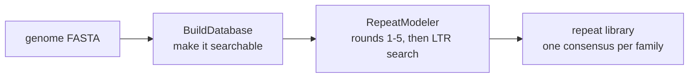
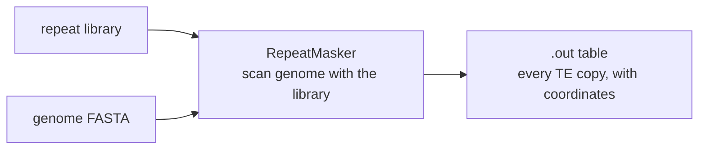
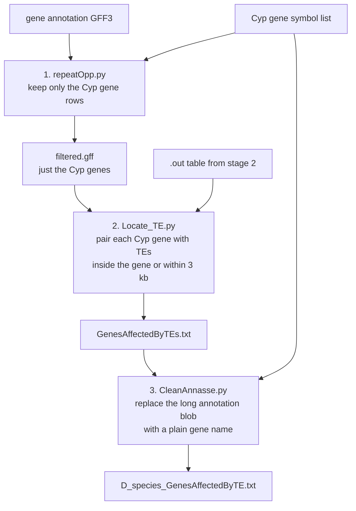
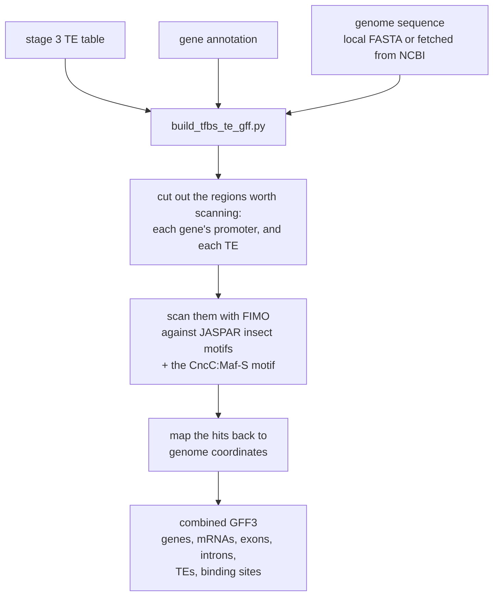
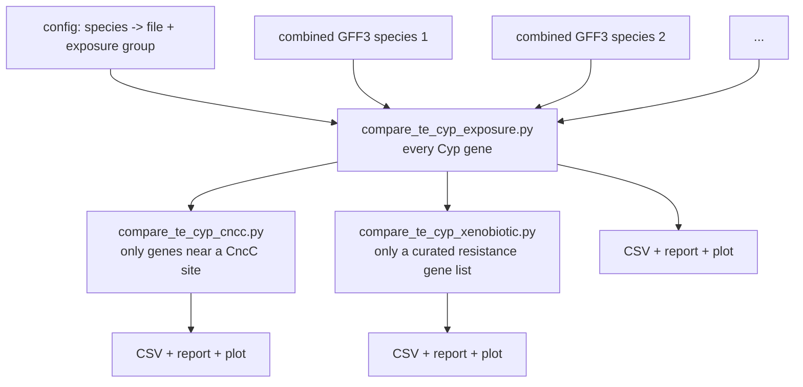

# The pipeline in six stages

One stage per section. Each says what goes in, what comes out, and roughly how long it takes.
Exact commands and file formats are in [`../detailed/02-stage-reference.md`](../detailed/02-stage-reference.md).

---

## Stage 1 — Build a repeat library for the species

**In:** one genome FASTA. **Out:** a library of every repeat family found in that genome.
**Time:** 8–26 hours, sometimes far longer.

A genome is full of repeated sequence, and most of it is transposable elements. But the
elements in a given species are not known in advance — you have to discover them from the
genome itself. That is what RepeatModeler does: it hunts for sequences that occur many times,
clusters them into families, builds a consensus sequence for each family, and classifies it
(LTR, LINE, DNA transposon, simple repeat, and so on).

Two things about this stage drive the whole project's design:

- **It is slow.** The lab's own figure is 8–26 hours depending on genome size *(OCR doc 04)*.
  One run captured in a screenshot took about 45 hours *(OCR doc 03c)*.
- **It is per-species and embarrassingly parallel.** Nothing about species A's run depends on
  species B's, so the only sane way to process dozens of genomes is to run several at once.

Originally this was done by hand: open a terminal, start an interactive container, type the
two commands, wait a day, repeat for the next species *(OCR docs 01, 04)*. The
`repeat-modeler-automation/` directory in this repository replaces that with workers that
claim genomes from a shared directory and survive reboots.

---

## Stage 2 — Find every copy of those repeats in the genome

**In:** the repeat library from stage 1, plus the same genome FASTA.
**Out:** a table of every TE occurrence and its exact coordinates.
**Time:** typically an hour or two.

Stage 1 discovered *what kinds* of element exist. Stage 2 finds *where every copy is*.
RepeatMasker takes the library as a custom search set and scans the genome with it, producing
a line per hit: which chromosome, which start and end position, which strand, which family,
and how divergent that copy is from the family consensus.

**This stage has no code in this repository.** It was run by a script called `runMasker.sh`
which was never photographed and never committed.

The stage itself is well documented even so: the lab notebook records the command
*(OCR doc 02)* and the write-up records the procedure *(OCR doc 05)* — including the detail
that RepeatMasker ran in the **same per-species folder** as RepeatModeler, so the library was
already sitting there and nothing had to be moved. What is missing is the script, not the
knowledge of what it did.

The `.out` files it produced are here, so everything downstream can be run and checked.

---

## Stage 3 — Work out which Cyp genes have TEs in or near them

**In:** the `.out` table from stage 2, a gene annotation for the species, and a list of Cyp
gene symbols. **Out:** one table per species of Cyp genes with the TEs that sit in or near them.
**Time:** seconds.

This is the narrow waist of the pipeline — the point where "everything about repeats" and
"everything about genes" finally meet. It is three small Python scripts run one after another:

The distance rule is worth remembering because everything downstream inherits it: a TE counts
as affecting a gene if it falls **within the gene's span extended by 3,000 base pairs at each
end**. That window is meant to catch elements sitting in the promoter, which is exactly where
the *Cyp6g1* / *Accord* case happened.

Historically these three scripts were run **by hand in VS Code**, once per species: open the
script, paste a file path into a specific line, save, click run — three times, with a
different path each time *(OCR docs 02, 05, 06)*. The hardcoded Windows paths still sitting at
the top of the committed scripts are the residue of that. Twenty-nine species were completed
this way.

---

## Stage 4 — Merge genes, TEs and regulatory motifs into one file

**In:** the stage 3 table, the gene annotation, and genome sequence.
**Out:** one combined GFF3 per species. **Time:** minutes.

Stage 3 produced a plain table. To view it in a genome browser, and to run the comparison,
everything has to become one properly-structured annotation file. That is what
`build_tfbs_te_gff.py` does — and while it has the sequence in hand, it also goes looking for
transcription factor binding sites.

The **CncC:Maf-S** motif is added deliberately on top of the JASPAR set. CncC is the master
regulator of insect detoxification — the switch that turns Cyp genes on in response to a
toxin — so a TE landing next to a CncC site is the most interesting possible case for this
project's question.

Motif scanning can be skipped entirely, which matters later: a species processed without it
has no binding sites in its file, and one of the three comparisons in stage 6 then has
nothing to work with.

---

## Stage 5 — Look at it

**In:** the combined GFF3 and the genome FASTA. **Out:** a genome browser view.

The combined file is loaded into JBrowse as a track against the species' assembly, so a
person can see the TEs, the Cyp genes and the predicted binding sites lined up along the
chromosome. This is how you catch the annotation being wrong in ways statistics will not tell
you about.

This stage is a person clicking, not a script. The procedure — open new genome, choose the
FASTA adapter, name the assembly after the species, then add the track — is recorded in the
lab notebook *(OCR doc 02)* and the write-up *(OCR doc 05)*. Sessions were saved for three
species: *D. melanogaster*, *D. simulans* and *D. sechellia* *(OCR docs 03b, 04)*.

---

## Stage 6 — Compare the species and report a verdict

**In:** one combined GFF3 per species, plus a config file saying which species are
heavily-sprayed and which are not. **Out:** a CSV table, a markdown report, and a plot.
**Time:** seconds.

All three run the same two statistical tests, on progressively narrower sets of genes:

- **Fisher's exact test** — does *having at least one TE* go with being in the
  high-exposure group?
- **Mann-Whitney U** — does the *number of TEs per gene* differ between the groups?

They also normalise for the obvious confounder: a species with more, or longer, Cyp genes
would appear to have more TEs simply by having more sequence to hit, so TEs per kilobase and
TEs per gene are reported alongside raw counts.

The reports are candid about the study's main weakness. With only a handful of species, the
test pools individual genes across species and treats each gene as an independent
observation, which it is not — genes in the same species share a genome and a history. Every
report generated says so in plain language rather than burying it.

---

## Next

- [Following one species](03-following-one-species.md) — the same six stages, with the real
  files from this repository
- [`../detailed/02-stage-reference.md`](../detailed/02-stage-reference.md) — the exact
  commands and parameters for each stage
